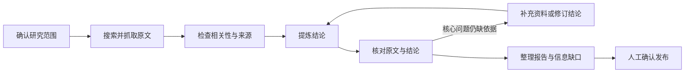

# Agent Investigator

基于 [DeerFlow](https://github.com/bytedance/deer-flow) 二次开发的竞品研究工作台：比较产品、核对原始资料，把事实、来源说法和信息缺口清楚地交付给使用者。

[快速开始](#快速开始) · [如何阅读研究结果](#如何阅读研究结果) · [文档目录](docs/README.md) · [开发与验证](#开发与验证)

## 项目能做什么

- 比较 2–5 个竞品，自定义比较项目，并指定必须回答的问题。
- 开始前确认研究范围与官方来源，完成后审核报告再发布。
- 按竞品和问题查找资料，先抓取正文并检查相关性，再接纳为证据。
- 将结论关联到原文引用；发现问题后补采、修订、拆分或排除错误结论。
- 显示资料覆盖、执行进度、来源解释、价格与收费方式。
- 输出包含对比矩阵的网页、Markdown 和 PDF 报告，保留已知信息缺口。
- 按产品规划、采购选型、销售或运营视角组织决策问题与建议。
- 筛选功能、价格和用户场景对比，打开保存原文并定位引用。
- 选中报告文字或指定缺失项目发起补研，生成新的待审核报告版本。

### 研究深度

| 模式 | 初始分析额度（2–5 个竞品） | 执行时间上限 | 自动补充轮数 |
| --- | --- | --- | --- |
| 快速了解 | 18–27 万 Token | 15 分钟 | 0 |
| 常规研究 | 30–52.5 万 Token | 30 分钟 | 1 |
| 深入研究 | 45–75 万 Token | 45 分钟 | 2 |

档位同时影响候选数量和阶段额度，事实与来源校验规则相同。执行上限不是预计耗时，Token 额度不是费用金额。范围确认后才开始计算正式研究期限。

报告批注会发起有独立额度的定向补研，提交前展示额度和时限。它会补充资料或修订结论并重新审计，不直接覆盖旧报告；每次研究最多接受三次补研请求。详见 [本轮产品改造](docs/RESEARCH_PRODUCT_ITERATION_2026-09-16_ZH.md)。

当前版本已完成研究闭环、来源分级和批注补研的代码实现与离线回归，仍需配置真实服务完成持续质量及生产环境验收。历史 B站播放器案例未完成完整审计，不能作为端到端研究成功的证明。详情见 [最新验收记录](docs/RESEARCH_PRODUCT_ITERATION_2026-09-16_ZH.md)。

## 研究如何进行



流程由服务端控制。任务状态、候选快照、引用、审计问题与预算写入数据库；执行中断后保留已完成的数据。

## 如何阅读研究结果

| 工作台标签 | 表示什么 |
| --- | --- |
| 官方资料说明 | 已确认的官方页面或仓库明确说明了这项信息，仍需留意版本和时间 |
| 厂商自述 | 厂商或项目自己的说法，不代表独立实测结果 |
| 个别用户反馈 | 有具体来源记录了反馈，不代表普遍现象 |
| 多个来源支持 | 多个来源的原文支持结论，且没有未解决的阻断问题 |
| 仍需核实 | 依据不足或存在实质问题，暂不作为确定事实 |

可信官方单来源可以支持范围明确的产品说明和价格，无需为凑域名数反复搜索。引文、数字、计费周期和语义支持仍须核对。来源评分只是筛选提示，不是结论正确概率。

报告区分：

- **研究完成**：核心要求已有依据。
- **研究完成，含已知缺口**：基本事实成立，其他问题仍缺资料；缺少资料不代表产品没有该能力。
- **研究未完成**：执行中断、某个竞品没有基本事实依据，或用户指定的必答项目未完成。

普通备注、可接受的信息缺口，以及没有找到充分支持的机会建议，不会被直接当作研究失败。

## 快速开始

### 运行条件

Python 3.12+、Node.js 22+、uv，以及前端项目指定的 pnpm 版本。宿主机前端命令统一通过 `scripts/pnpm.py` 执行；该入口也支持 Corepack。

```bash
git clone https://github.com/ourhome-macro/agent-investigator.git
cd agent-investigator
```

配置文件放在仓库根目录：

| 模板 | 本地文件 | 用途 |
| --- | --- | --- |
| `config.example.yaml` | `config.yaml` | 模型、运行时、数据库与搜索工具配置 |
| `extensions_config.example.json` | `extensions_config.json` | MCP 和技能配置 |
| `.env.example` | `.env` | 模型、搜索、抽取和存储凭据 |

实际配置、凭据和运行数据均不进入 Git。已有本地文件时保留原配置。

在 `config.yaml` 中启用研究依赖的持久任务服务：

```yaml
subagent_batches:
  enabled: true
```

配置默认主模型，以及名为 `deepseek-v4-flash` 的模型配置；当前收集和分析步骤使用后者。模型字段中的凭据引用环境变量，真实值放在 `.env`。

### 标准开发方式

在支持 Make 和项目 Shell 脚本的环境中，从仓库根目录执行：

```bash
make config
# 编辑生成的配置并准备 .env，设置模型与服务凭据。
make install
make dev
```

浏览器打开 `http://localhost:2026/workspace/investigations`，首次访问按提示创建管理员账号。

标准入口为 Nginx `2026`，内部 Gateway `8001`、前端 `3000`。Docker 发布入口默认绑定 `127.0.0.1`；外网部署需要额外完成访问控制、代理和运行环境验证。

### Windows PowerShell

完整的配置创建、依赖安装和双终端启动命令见 [Windows 启动指南](docs/COMPETITIVE_RESEARCH_WINDOWS_SETUP_ZH.md)。该方式使用 Gateway `18001`、前端 `13000`，适合不通过 Nginx 的本地开发。

### 搜索、抽取与生产条件

| 场景 | 所需条件 |
| --- | --- |
| 本地开发 | 已配置模型、持久任务服务；可使用开发搜索与本地存储，但质量仍需验证 |
| 真实研究验收 | Bocha 或 Tavily、Jina、语义 Embedding 配置，以及可用的模型服务 |
| 生产部署 | 以上条件，加 PostgreSQL、Redis StreamBridge、DB Run Events、S3 兼容存储与受 SSRF 保护的浏览器抓取 |

生产覆盖文件为 [docker-compose.deep-research.yaml](docker/docker-compose.deep-research.yaml)，与基础 Compose 组合使用。部署说明见 [当前规格](docs/COMPETITIVE_RESEARCH_V1_SPEC.md) 和 [DeerFlow 运行参考](DEERFLOW_REFERENCE.md)。

## 升级现有环境

Gateway 启动时运行独立的调查数据库迁移，当前链为 `ci_0012`：

- `ci_0010`：候选快照、预算预留与结论提交幂等映射。
- `ci_0011`：来源等级、批准的官方仓库与必答项目。
- `ci_0012`：资源策略快照、决策目标、结论条件与版本绑定的补研请求。

升级前备份数据库，更新代码后重启 Gateway；生产前端需重新构建。历史调查和报告保留，旧的单来源结论不会仅靠迁移被升级为已验证事实。

## 开发与验证

后端实现位于 `backend/app/investigations/`；前端工作台位于 `frontend/src/app/workspace/investigations/`。

```powershell
# 仓库根目录；已安装依赖。
python scripts/pnpm.py check
python scripts/pnpm.py exec rstest run tests/unit/core/investigations

# 后端目录。
Set-Location backend
$researchTests = Get-ChildItem tests -Filter 'test_investigation*.py' | ForEach-Object FullName
.\.venv\Scripts\python.exe -m pytest @researchTests -q -p no:cacheprovider
.\.venv\Scripts\python.exe -m scripts.benchmark.competitive_research preflight
```

`preflight` 检查配置是否存在，不调用模型或搜索，也不代表服务连通性验收。完整后端测试入口为 `make test` 和 `make test-blocking-io`，适用环境及本地已知限制见 [验证记录](docs/RESEARCH_PRODUCT_ITERATION_2026-09-16_ZH.md)。

## 文档

- [文档总目录](docs/README.md)：按使用、设计、验证与历史记录分类。
- [当前规格](docs/COMPETITIVE_RESEARCH_V1_SPEC.md)：数据约束、预算、完成条件与部署要求。
- [编排与恢复](docs/COMPETITIVE_RESEARCH_MULTI_AGENT_ORCHESTRATION.md)：状态推进、审计动作、重试与恢复。
- [来源分级与工作台](docs/COMPETITIVE_RESEARCH_CONFIDENCE_AND_WORKSPACE_ZH.md)：当前规则及界面说明。
- [B站案例记录](docs/BILIBILI_PLAYER_COMPETITIVE_RESEARCH_ZH.md)：历史失败案例与独立研究材料。
- [DeerFlow 通用参考](DEERFLOW_REFERENCE.md)：继承的运行时、沙箱、记忆、技能和渠道能力。

## 开源基础与许可

本项目基于 DeerFlow，保留其运行时和全栈基础。上游介绍与多语言参考保留在 [DeerFlow 参考文档](DEERFLOW_REFERENCE.md) 及 `README_*.md`，不代表本项目已经完成其中所有能力的生产验收。

采用 [MIT License](LICENSE)。开发约定见 [AGENTS.md](AGENTS.md)，贡献说明见 [CONTRIBUTING.md](CONTRIBUTING.md)。
