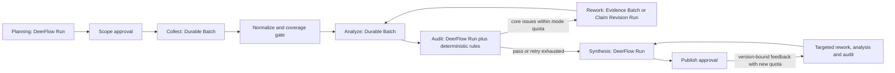

# Competitive Research Multi-Agent Orchestration

This document is the runtime contract for the Competitive Research V1
multi-agent workflow. Stage progression is owned by application code; model
output is data and never controls the state machine directly.

## End-to-end flow



Every executable unit uses the same protocol:

```text
StageTask -> Agent execution -> DomainSubmission -> validation -> AgentReceipt
```

`StageTask` carries the investigation, workflow, stage, item, role,
idempotency key, input, and acceptance criteria. `DomainSubmission` must copy
all correlation fields exactly and use the submission kind allowed for the
stage. `AgentReceipt` records the execution status, attempt, DeerFlow Run or
durable Batch identifiers, model, token use, warnings, and error.

## Six runtime layers

### Scheduling

`InvestigationWorkflowService` claims a persistent `ci_workflow_runs` lease.
`DurableCompetitiveOrchestrator` decides the stage, role, fan-out dimensions,
model class, concurrency, acceptance threshold, and next transition.

- Planning, Audit, and Synthesis use ordinary DeerFlow Runs and the Pro model
  selected by the lead-agent configuration.
- Collect creates one Flash-model item per competitor after server-side searches
  and snapshot admission for individual dimensions.
- Analyze creates one Flash-model item per competitor with scoped retrieval.
- Rework targets blocking issues affecting core requirements and missing
  competitor facts; it can collect evidence or revise/split/retire Claims.
- A version-bound user annotation enters a separate durable request. Its target
  takes precedence over the automatic core-gap filter, so optional questions can
  be explicitly researched without restarting every competitor.

### Communication

Agents do not share mutable LangGraph state across isolated executions. The
durable communication boundary is the typed protocol plus SQL records:

- task envelope and validated submission in `ci_stage_items`;
- execution outcome in `AgentReceipt`;
- accepted facts in Evidence/Claim/Audit/Report repositories;
- progress and provenance in `ci_events`.

This avoids making one agent's private message history the source of truth.

### Isolation

Collect, Analyze, and Rework items execute independently in DeerFlow durable
subagent batches. One failed item does not cancel siblings. The orchestrator
evaluates stage acceptance after terminal receipts. Planning and Synthesis use
ordinary Runs; Audit uses groups of at most four Claims, with independent
task retry counts. Failure does not corrupt completed Evidence or Claim records.

### Evidence and audit

Only accepted DomainSubmissions can reach the repositories. Evidence is URL
canonicalized, content-hashed, scored deterministically, and owner-scoped.
Claims may reference only active Evidence. Source-aware confidence accepts
confirmed official statements with one source, keeps vendor/user testimony
attributed, and requires corroboration for broader unqualified claims.
Non-blocking notes and optional gaps do not force more research or prevent
completion; approved required dimensions and missing competitor facts do.

Audit has two independent checks:

1. deterministic rules enforce quote integrity, source-aware sufficiency and
   publication eligibility;
2. the Evidence Auditor checks semantic entailment, contradictions, exact
   values, pricing provenance, and source quality.

Open issues are persisted in `ci_audit_issues`; omission does not resolve them.
Resolution requires a reason and a matching Claim version. Rework can target a
Claim or a core coverage gap without a Claim. Replacement Claims preserve
retirement history. Collected conflict evidence enters as context until Audit
determines its relation; re-analysis precedes the next Audit.

For user feedback, analysis and audit are scoped to the target competitor and
dimension. Audit may update only that Claim set and resolve only matching issues;
it must not reset other competitors' verified bindings. A gap without a Claim is
resolved only after the target cell has audited factual coverage. An unanswered
annotation remains visible and makes the new report incomplete, even if the
workflow itself finished successfully.

### Validation

Validation occurs at three gates:

1. protocol gate: strict JSON, schema, allowed kind, and exact correlation;
2. stage gate: minimum successful-item and Evidence/Claim coverage;
3. publication gate: eligible Claim versions, source attribution and current
   core completion requirements, followed by human approval. Optional gaps are
   permitted; interrupted runs remain partial.

Markdown is rendered from the structured report. It is never parsed back into
business state.

### Retry and recovery

- Durable Batch owns item leases and its configured retry budget.
- Ordinary DeerFlow Run stages allow three total attempts (initial plus two
  retries).

Research batches request one execution attempt so workflow recovery/rework can
reserve new investigation quota before a retry. Audit is split into groups of
at most four Claims, each with its own retry count and durable task identity.
Candidate data and stage inputs persist across restart; report output is rendered
from eligible Claim versions rather than model-authored factual Markdown.

- Workflow leases are renewed every forty seconds. Lease loss cancels only the
  local orchestration coroutine; a recovery owner resumes the persisted Run or
  Batch.
- Stage item row identity is separate from protocol task identity, so a retry
  cannot collide with the previous database row.
- Validated DomainSubmissions are persisted before stage completion. A crash
  between model completion and domain-side effects can replay the same
  submission without asking the model again.
- Stable workflow, stage, and Batch submission keys prevent duplicate work on
  process restart.
- Feedback workflow keys include the request ID. Report submissions also retain
  the source task ID, making report creation replay-safe. The new report and
  feedback outcome commit in one transaction; old published versions are retained.
- Owner-scoped feedback admission uses version checks, idempotency and an atomic
  state update. Cancellation marks the request cancelled in the state transaction,
  including when execution has not yet started.

## Resource policy

`product.py` owns the versioned resource catalog used by the creation form and
runtime. Each investigation stores a policy snapshot. Quick, standard and deep
modes change search/candidate counts, stage caps, total quota, deadline and
automatic rework rounds (0/1/2); they share one source-aware confidence policy.
The formal execution deadline starts at scope approval. Older records without a
snapshot retain their previous two-round policy.

Explicit feedback has a separately disclosed fifteen-minute window and a
mode-dependent allowance; each investigation accepts at most three requests.
Outstanding reservations prevent a new request, unused prior quota is discarded,
and repeated submissions with the same body/key do not allocate more capacity.
See the [current contract](COMPETITIVE_RESEARCH_V1_SPEC.md) for exact limits.

## Operational limits and remaining production work

The orchestration path is implemented, but external production rollout still
requires deployment validation of PostgreSQL, Redis and S3-compatible storage,
configured live providers, and fault-injection E2E checks against actual DeerFlow
Run and Batch workers. Budget reservations and text preflight are implemented;
their behavior with real provider billing, failures and cancellation still needs
live acceptance evidence. See the [current contract](COMPETITIVE_RESEARCH_V1_SPEC.md).
