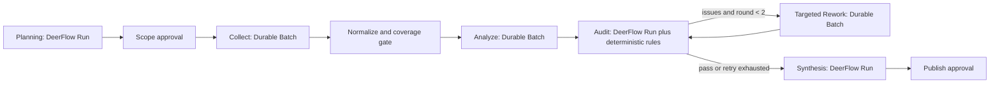

# Competitive Research Multi-Agent Orchestration

This document is the runtime contract for the Competitive Research V1
multi-agent workflow. Stage progression is owned by application code; model
output is data and never controls the state machine directly.

## End-to-end flow



Every executable unit uses the same protocol:

```text
StageTask -> Agent execution -> DomainSubmission -> validation -> AgentReceipt
```

`StageTask` carries the investigation, workflow, stage, item, role,
idempotency key, input, and acceptance criteria. `DomainSubmission` must copy
all correlation fields exactly and use the submission kind allowed for the
stage. `AgentReceipt` records the execution status, attempt, DeerFlow Run or
durable Batch identifiers, model, token use, warnings, and error.

## Six runtime layers

### Scheduling

`InvestigationWorkflowService` claims a persistent `ci_workflow_runs` lease.
`DurableCompetitiveOrchestrator` decides the stage, role, fan-out dimensions,
model class, concurrency, acceptance threshold, and next transition.

- Planning, Audit, and Synthesis use ordinary DeerFlow Runs and the Pro model
  selected by the lead-agent configuration.
- Collect creates one Flash-model item per competitor and research dimension.
- Analyze creates one Flash-model item per analysis dimension.
- Rework creates only the evidence items required by open audit issues.

### Communication

Agents do not share mutable LangGraph state across isolated executions. The
durable communication boundary is the typed protocol plus SQL records:

- task envelope and validated submission in `ci_stage_items`;
- execution outcome in `AgentReceipt`;
- accepted facts in Evidence/Claim/Audit/Report repositories;
- progress and provenance in `ci_events`.

This avoids making one agent's private message history the source of truth.

### Isolation

Collect, Analyze, and Rework items execute independently in DeerFlow durable
subagent batches. One failed item does not cancel siblings. The orchestrator
evaluates a stage-level coverage barrier after all terminal receipts. Planning,
Audit, and Synthesis are single Run stages, so their failure stops that stage
but does not corrupt completed Evidence or Claim records.

### Evidence and audit

Only accepted DomainSubmissions can reach the repositories. Evidence is URL
canonicalized, content-hashed, scored deterministically, and owner-scoped.
Claims may reference only active Evidence. Material claims require two
independent domains or remain `uncertain`.

Audit has two independent checks:

1. deterministic rules enforce evidence presence and independent-domain
   thresholds;
2. the Evidence Auditor checks semantic entailment, contradictions, exact
   values, pricing provenance, and source quality.

Open issues are persisted in `ci_audit_issues`. Rework targets an exact Claim
and issue, and accepted new Evidence is linked back to that Claim before the
next audit.

### Validation

Validation occurs at three gates:

1. protocol gate: strict JSON, schema, allowed kind, and exact correlation;
2. stage gate: minimum successful-item and Evidence/Claim coverage;
3. publication gate: all eleven structured report sections and valid
   Claim/Evidence references, followed by human approval.

Markdown is rendered from the structured report. It is never parsed back into
business state.

### Retry and recovery

- Durable Batch owns item leases and its configured retry budget.
- Ordinary DeerFlow Run stages allow three total attempts (initial plus two
  retries).
- Workflow leases are renewed every forty seconds. Lease loss cancels only the
  local orchestration coroutine; a recovery owner resumes the persisted Run or
  Batch.
- Stage item row identity is separate from protocol task identity, so a retry
  cannot collide with the previous database row.
- Validated DomainSubmissions are persisted before stage completion. A crash
  between model completion and domain-side effects can replay the same
  submission without asking the model again.
- Stable workflow, stage, and Batch submission keys prevent duplicate work on
  process restart.

## Operational limits and remaining production work

The orchestration path is implemented, but external production rollout still
requires PostgreSQL and Redis deployment validation, S3-compatible Evidence
snapshots, provider credentials and health checks, total token/deadline
cancellation enforcement across every stage, and a fault-injection E2E run
against live DeerFlow Run and Batch workers.
